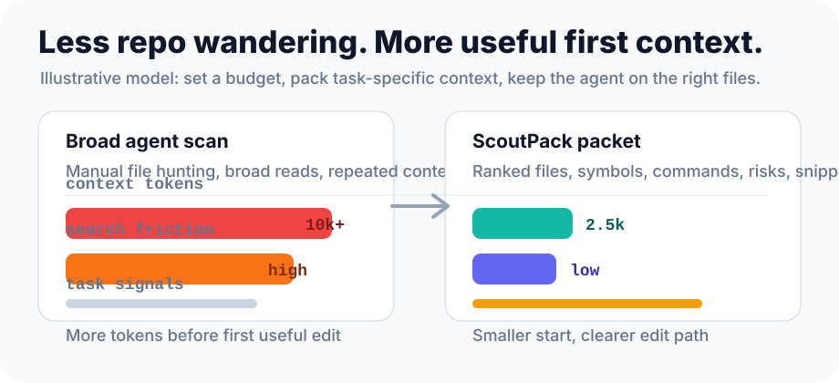

<p align="center">
  
</p>

<p align="center">
  <strong>Offline repo context compiler for AI coding agents.</strong>
</p>

<p align="center">
  Build a local searchable index, then hand Codex, Claude Code, Cursor, Aider, and other agents only the files, symbols, snippets, commands, and risks that matter.
</p>

<p align="center">
  <a href="https://github.com/theamodhshetty/ScoutPack/actions/workflows/ci.yml"></a>
  <a href="LICENSE"></a>
  <a href="Cargo.toml"></a>
  <a href="docs/mcp.md"></a>
  
</p>

<p align="center">
  <a href="#quick-start">Quick Start</a> ·
  <a href="#efficiency-model">Efficiency</a> ·
  <a href="#demo">Demo</a> ·
  <a href="#mcp-server">MCP</a> ·
  <a href="#agent-client-setup">Agents</a> ·
  <a href="#commands">Commands</a> ·
  <a href="docs/installation.md">Install</a> ·
  <a href="docs/milestones.md">Roadmap</a>
</p>

---

## Why ScoutPack

AI coding agents are powerful, but they still burn time and tokens when they start with the wrong repo context.

| Without ScoutPack | With ScoutPack |
| --- | --- |
| Agent scans broad folders. | Agent starts with ranked files and symbols. |
| Repo conventions get missed. | Package scripts and framework signals are included. |
| Secret files are risky. | Sensitive patterns are skipped by default. |
| Context grows into noise. | Packets stay under a token budget. |
| Debugging starts from guesses. | Risks include source-backed evidence. |

ScoutPack answers one practical question before edits start:

```txt
What should this AI agent read first for this task?
```

## One-Minute Flow

```bash
cargo install --git https://github.com/theamodhshetty/ScoutPack.git

cd your-project
scoutpack init
scoutpack pack .
scoutpack context "fix login redirect loop" --budget 2500
```

Output is local, compact, and agent-ready:

```md
# ScoutPack Context

Task:
fix login redirect loop

Relevant Files:
- `src/app/login/page.tsx`: component `LoginPage`
- `src/lib/session.ts`: function `getSession`
- `src/middleware/auth.ts`: function `requireAuth`

Current Repo Signals:
- Framework: Next.js, React, Vitest
- test command: `vitest`
- build command: `next build`

Risks:
- redirect loop if post-login destination points back to login or auth guard
  (source: `src/middleware/auth.ts:3-14`)
```

No cloud. No API key. No telemetry. No auto-edits. No project command execution.

## Efficiency Model

<p align="center">
  
</p>

ScoutPack keeps the first agent prompt small and targeted: if an agent would otherwise read broad files and chat history before finding the right area, ScoutPack lets you start from a focused packet such as `--budget 2500`. Reproducible numbers live in [benches/RESULTS.md](benches/RESULTS.md).

| Efficiency lever | How ScoutPack helps |
| --- | --- |
| Fewer wasted reads | ranked search points at likely edit files first |
| Smaller first prompt | `context --budget` trims snippets to a fixed target |
| Less manual setup | package scripts, framework signals, and risks are included |
| Better dependency trail | `context --expand-calls` follows direct symbol calls |
| Better handoff | Markdown, JSON, and MCP all expose the same local index |
| Safer context | common secret files skipped before indexing |

## What You Get

| Feature | What it does |
| --- | --- |
| Local index | SQLite + FTS5 index in `.scoutpack/` |
| Smart scan | Respects `.gitignore`, `.scoutpackignore`, binary limits, and sensitive skips |
| Code structure | TypeScript/TSX symbols, route handlers, imports, Markdown sections, config chunks |
| Task context | Token-budgeted packet with relevant files, snippets, commands, and risks |
| Prompt templates | Built-in bugfix, refactor, review, docs, and test prompts |
| MCP server | Read-only `search`, `context`, `template`, `file_summary`, `symbol`, `commands`, `recent_changes`, `stats` tools |
| Automation output | JSON mode for wrappers and scripts |

## Search Terms

People may look for this as AI coding agent context, local codebase search for AI, offline repo indexing, context engineering for code, local-first RAG alternative, token-budgeted code context, repo map, MCP code search, or private repo context.

## Install

From a local checkout:

```bash
git clone https://github.com/theamodhshetty/ScoutPack.git
cd ScoutPack
cargo install --path .
```

From GitHub:

```bash
cargo install --git https://github.com/theamodhshetty/ScoutPack.git
```

From a release binary on macOS/Linux:

```bash
curl -fsSL https://raw.githubusercontent.com/theamodhshetty/ScoutPack/main/install.sh | sh
```

Requirements:

- Rust stable
- SQLite support is bundled through `rusqlite`
- no Node install required for ScoutPack itself

More detail: [docs/installation.md](docs/installation.md).

## Quick Start

Inside any repo:

```bash
scoutpack init
scoutpack pack .
scoutpack search "auth middleware" --limit 5
scoutpack context "fix login redirect loop" --budget 2500
scoutpack stats
```

ScoutPack writes local-only data:

```txt
.scoutpack/
  pack.sqlite
  manifest.json
  repo-map.md
```

## Demo

Search:

```txt
1. src/middleware/auth.ts:3-14 [function] requireAuth
   reason: matched auth in path, matched middleware in path
```

Context packet:

```md
# ScoutPack Context

Task:
fix login redirect loop

Relevant Files:
- `src/app/login/page.tsx`: component `LoginPage`
- `src/lib/session.ts`: function `getSession`
- `src/middleware/auth.ts`: function `requireAuth`

Current Repo Signals:
- Framework: Next.js, React, Vitest
- test command: `vitest`
- lint command: `eslint .`
- build command: `next build`

Likely Edit Areas:
- `src/app/login/page.tsx:3-11`
- `src/lib/session.ts:5-7`
- `src/middleware/auth.ts:3-14`
- auth/session boundary files
- redirect and destination parameter handling

Risks:
- redirect loop if post-login destination points back to login or auth guard (source: `src/middleware/auth.ts:3-14`)
```

Full sample: [examples/context.md](examples/context.md).

## MCP Server

Use ScoutPack directly from MCP-aware agent clients:

```json
{
  "mcpServers": {
    "scoutpack": {
      "command": "scoutpack",
      "args": ["mcp", "."]
    }
  }
}
```

Available tools:

| Tool | Returns |
| --- | --- |
| `search` | ranked files, symbols, snippets, and reasons |
| `context` | full task packet with estimated token count |
| `template` | agent-ready prompt from a named template plus local context |
| `file_summary` | indexed file metadata, symbols, and chunk ranges |
| `symbol` | exact or partial symbol matches |
| `commands` | discovered package scripts without running them |
| `recent_changes` | local git diff summary for branch, diff, or since ranges |
| `stats` | index counts and manifest details |

HTTP/SSE clients can use the same tools at `http://127.0.0.1:7777/mcp`:

```bash
scoutpack mcp . --http --port 7777
```

Full setup: [docs/mcp.md](docs/mcp.md).

## Agent Client Setup

| Client | Fast path | Notes |
| --- | --- | --- |
| Codex | Run `scoutpack context "task" --budget 2500`, paste packet into task. | MCP users can configure ScoutPack as a local stdio MCP server. |
| Claude Code | Add ScoutPack via `.mcp.json` or `claude mcp add`, then ask Claude to use `scoutpack.context`. | Best for repeated repo work. |
| GitHub Copilot / VS Code | Add ScoutPack to `.vscode/mcp.json`, open Copilot Chat Agent mode, enable tools. | Uses VS Code MCP config format. |
| Cursor | Add ScoutPack to Cursor MCP config or paste `context` output. | Same read-only tools over stdio or HTTP/SSE where supported. |
| Aider | Use `search` output to choose files, then add them to Aider. | Good when you want explicit file control. |
| Scripts/CI helpers | Use `search --json`, `context --json`, `stats --json`. | Stable machine-readable output. |

Shared local stdio server:

```json
{
  "mcpServers": {
    "scoutpack": {
      "command": "scoutpack",
      "args": ["mcp", "."]
    }
  }
}
```

VS Code / GitHub Copilot workspace config uses `servers`:

```json
{
  "servers": {
    "scoutpack": {
      "type": "stdio",
      "command": "scoutpack",
      "args": ["mcp", "."]
    }
  }
}
```

More workflows: [docs/ai-agent-workflows.md](docs/ai-agent-workflows.md).

## Commands

```bash
scoutpack init
```

Creates `scoutpack.toml` and `.scoutpackignore`.

```bash
scoutpack pack .
```

Scans and indexes a repo. Re-running `pack` reuses unchanged files.

```bash
cargo install --git https://github.com/theamodhshetty/ScoutPack.git --features semantic
scoutpack pack . --embed
scoutpack search "login flow" --semantic
scoutpack context "fix login flow" --semantic --budget 2500
```

Optional local semantic search. This is not enabled in default installs. First use may download the local `BAAI/bge-small-en-v1.5` model after confirmation; ScoutPack still stores embeddings only in local SQLite and does not call model APIs.

```bash
scoutpack watch .
```

Keeps the local index fresh while you edit. Debounced re-index output goes to stderr.

```bash
scoutpack search "auth middleware" --limit 5
```

Searches the local index and returns ranked files/symbols with reasons.

```bash
scoutpack search "auth middleware" --limit 5 --json
```

Returns machine-readable JSON for scripts and tools.

```bash
scoutpack context "fix login redirect loop" --budget 2500
```

Builds a markdown packet for an AI coding task.

```bash
scoutpack context "fix login redirect loop" --expand-calls 2 --budget 2500
```

Adds symbols called by matched symbols, useful when root-cause code lives behind a helper or service call.

```bash
scoutpack template bugfix "fix login redirect loop" --budget 2500
```

Builds an agent-ready prompt from a template plus ScoutPack context. Built-ins: `bugfix`, `refactor`, `review`, `docs`, `test`.

```bash
scoutpack context "review my PR" --branch
scoutpack context "review auth changes" --diff main..HEAD
scoutpack context "continue indexing work" --since HEAD~5
```

Adds a Recent Changes section and prioritizes changed files from the local git range.

```bash
scoutpack context "fix login redirect loop" --budget 2500 --json
```

Returns the context packet plus metadata as JSON.

```bash
scoutpack context "fix login redirect loop" --format xml
```

Returns XML-wrapped context for prompt templates. Supported formats: `markdown`, `json`, `xml`.

```bash
scoutpack stats
```

Shows local index counts and manifest details.

```bash
scoutpack stats --json
```

Returns index stats and manifest data as JSON.

```bash
scoutpack mcp .
```

Starts a read-only stdio MCP server over the existing local index. Tools include `search`, `context`, `template`, `file_summary`, `symbol`, `commands`, `recent_changes`, and `stats`.

```bash
scoutpack mcp . --http --port 7777
```

Starts the same MCP tools over local Streamable HTTP/SSE at `http://127.0.0.1:7777/mcp`.

```bash
scoutpack completions zsh > _scoutpack
```

Generates shell completions for `bash`, `zsh`, `fish`, `powershell`, or `elvish`.

## Supported Today

| Area | Support |
| --- | --- |
| JavaScript / JSX | tree-sitter symbols, imports, CommonJS requires, functions, classes, components, route handlers |
| TypeScript / TSX | tree-sitter symbols, imports, functions, components, route handlers |
| Python | tree-sitter functions, classes, imports, FastAPI-style route decorators, `pyproject.toml`, `requirements.txt`, `Pipfile`, `setup.cfg` |
| Rust | tree-sitter functions, structs, enums, traits, impl blocks, modules, use imports |
| Go | tree-sitter packages, imports, functions, methods, structs, interfaces, `go.mod` |
| Solidity | tree-sitter contracts, interfaces, libraries, functions, modifiers, events, imports |
| Markdown | heading-based sections |
| JSON | package scripts, dependencies, framework signals |
| YAML / TOML | config chunks |
| Search | SQLite FTS5 plus deterministic ranking |
| Optional semantic search | local fastembed embeddings behind `--features semantic`; never enabled by default |
| Context | markdown packets with budget-aware snippets |
| Templates | built-in and custom Markdown prompt templates |
| MCP | read-only stdio server for agent clients |
| Distribution | Cargo install plus generated shell completions |
| Privacy | local-only index, sensitive file skips |

## Not In Scope Yet

- cloud sync
- GUI
- auto-edits
- running package scripts
- executing project commands from watch mode

## Privacy And Security Guarantees

ScoutPack is offline by design:

- does not send code anywhere
- does not call external APIs in default FTS mode
- optional semantic mode may download a local embedding model only after confirmation
- does not collect telemetry
- does not run project commands
- writes local SQLite index data only under `.scoutpack/`
- supports `.scoutpackignore`
- skips common secret files such as `.env`, `.env.local`, private keys, certificates, `.npmrc`, `.pypirc`, `secrets.yaml`, and `secrets.json`
- skips common generated folders such as `node_modules`, `.git`, `.next`, `dist`, `build`, `coverage`, `target`, and `.venv`

Limit: ScoutPack is not a secret scanner. Review generated context before pasting it into any external AI provider.

Security details: [SECURITY.md](SECURITY.md).

## Docs

- [Installation](docs/installation.md)
- [Distribution](docs/distribution.md)
- [MCP server](docs/mcp.md)
- [Prompt templates](docs/templates.md)
- [AI agent workflows](docs/ai-agent-workflows.md)
- [Use cases](docs/use-cases.md)
- [FAQ](docs/faq.md)
- [Design](docs/design.md)
- [Milestones](docs/milestones.md)
- [Release checklist](docs/release-checklist.md)
- [Roadmap](ROADMAP.md)
- [Changelog](CHANGELOG.md)

## Development

```bash
cargo fmt --check
cargo test
```

Contributing guide: [CONTRIBUTING.md](CONTRIBUTING.md).

## License

MIT. See [LICENSE](LICENSE).
